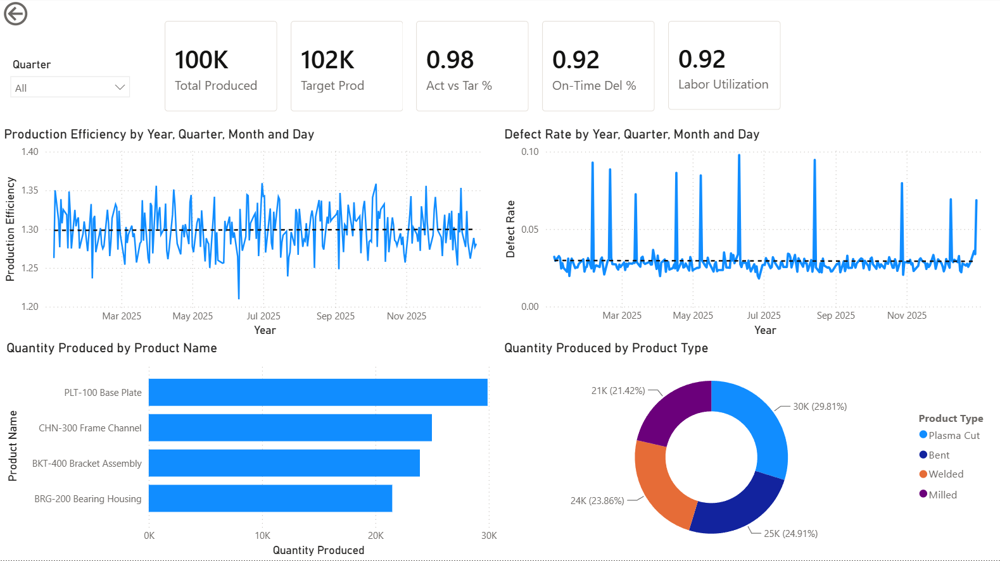

# Steel Manufacturing Analytics | Power BI

Synthetic star-schema dataset and Power BI dashboard for a steel fabrication plant (plasma cutting, milling, bending, welding). Built to analyze production stability, quality defects, labor efficiency, and shipping performance.



## Business Context

- **Industry:** Steel fabrication
- **Operations:** 1 day shift, Mon–Fri (255 production days in 2025)
- **Products:** Base plates (plasma cut), bearing housings (milled), frame channels (bent), bracket assemblies (welded)
- **Goal:** Track whether daily output stays stable and how quality issues affect shipping

## Data Model

Star schema with conformed dimensions:

| Type | Tables |
|------|--------|
| **Dimensions** | `DimDate`, `DimProduct`, `DimDepartment` |
| **Facts** | `FactProduction`, `FactQuality`, `FactLabor`, `FactShipping` |

**Relationships:** All facts → `DimDate`. Production & Quality → `DimProduct`. Labor → `DimDepartment`.

**Grain:**
- Production / Quality → Date × Product
- Labor → Date × Department
- Shipping → Date (plant level)

## Dashboard

| Page | Focus |
|------|--------|
| Executive Dashboard | Volume, defect rate, on-time %, labor hours |
| Operations Dashboard | Monthly output vs target, defect trends by product |
| Labor & Efficiency | Hours by department, units per labor hour |
| Shipping | On-time delivery and link to quality |

## Insights

**Production:**
- Which product is furthest from its daily target most often, and is that gap widening over time?
  - Q4's higher than expect outputs in Oct put undue stress on the system. Balance output to maintain consistency.
    - The gap is fairly stable, End of Year caused bottlenecks down the chain.

**Quality**
- Which product has the highest defect rate, and is it getting better or worse quarter over quarter?
  - PLT-100, BASE PLATE - Higher output increased the chance of defects, however february had 2 days and a rate of .04, 25% increase vs the nominal.
    - Process is complex, possible issues at the time: Training, maintenance, defective plate - further investigation on the ground is needed
  
- Do defect spikes happen randomly, or do they cluster in specific weeks or months?
  - Grain on this report isnt daily, but spikes trend towards mid-week.
    - Possible solution: Mid week checks on QA by management, do not impact output.

**Labor and Efficiency**
- Does units-per-labor-hour differ meaningfully by product, and what would explain that?
  - QA/QC - outlier by 11 hours - End of Year checks caught more, tringging more time required to check additional parts

**Shipping**
- Is on-time performance stable, or are there periods we'd fail a customer SLA?
  - Partly stable, EOY issues slowed delivers.
    - Solution: slow production numbers, increased attention.
- When late orders spike, does it align with high-defect or low-production days?
  - High defects and lower production contributed to lower On-Time Deliveries, bottlenecking due to having to check more product before shipping.


Data can be regenerated, and loaded to give a different randomized effect on the data. This was one iteration to showcase. 
## Getting Started

### 1. Regenerate data 

```bash
node generate_data.js
